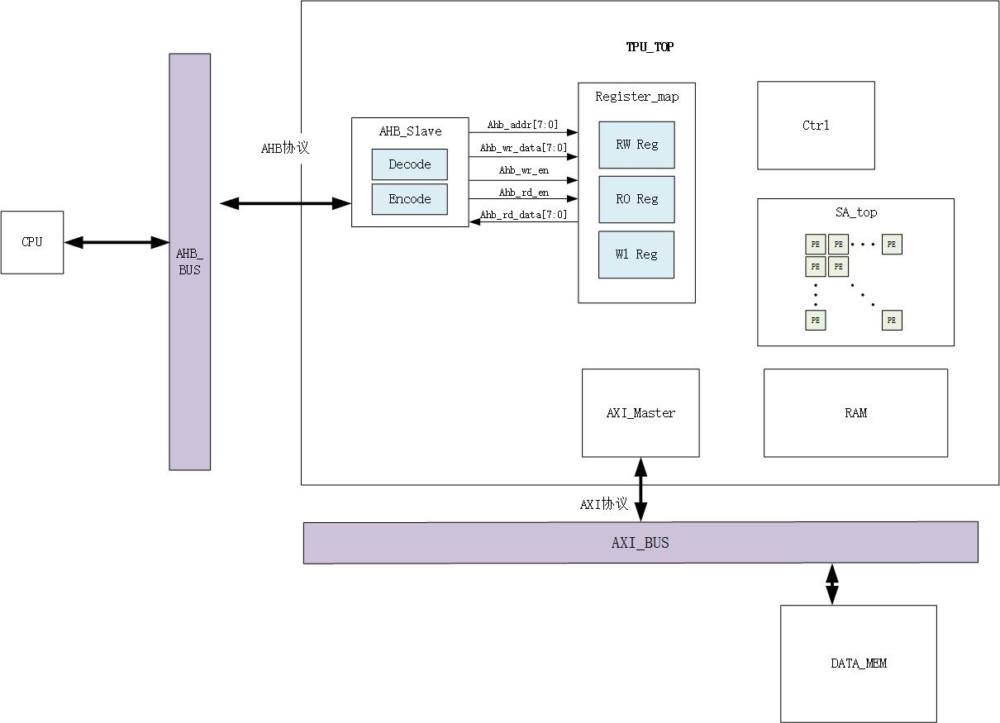
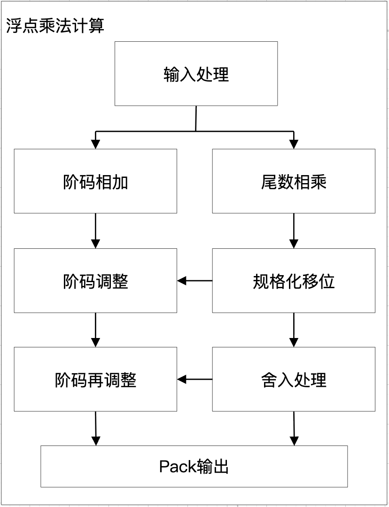

# TPU



## systolic array: SA.v
1. 概述: 实例化 16*16 个 PE modules `PE.v` 形成一个脉动阵列 systolic array, 用于执行矩阵乘法
2. I/O interface:
   - `input wire [31:0] i_A [15][15];`
   - `input wire [31:0] i_B [15][15];`
   - `output wire [31:0] i_AB [15][15];`

## processing unit: PE.v
1. 概述: 每个PE模块对输入 `i_a`, `i_b` 支持四种精度运算(fp32, fp16, int8, int4), 针对不同的精度做不同的运算
   - 针对fp32: fp32 浮点数乘法 `PE_fp32_multiply.v`, 位宽变换
   - 针对fp16: 对输入取低16位, fp32 浮点数乘法 `PE_fp32_multiply.v`, 位宽变换
   - 针对int8: 浮定转换, 定点数乘法, 位宽变换, 定浮转换
   - 针对int4: 定点数乘法, 位宽变换
2. I/O interface:
   - `input wire [31:0] i_a;`
   - `input wire [31:0] i_b;`
   - `output wire [31:0] o_a;`: 将 `i_a` 传给右边和下边的PE module in the systolic array
   - `output wire [31:0] o_b;`: 将 `i_b` 传给右边和下边的PE module in the systolic array
   - `output wire [31:0] o_PE_current_value;`: 目前计算累加得到的值，用于脉动阵列下一次"脉动"后的计算累加


### fp32 浮点数乘法: PE_fp32_multiply.v
1. 概述: 使用 IEEE 32-bit floating-point binary format 定义的32位浮点数 ([31]: sign; [30:23]: exponent; [22:0]: fraction; bias = 127) 实现32位浮点数乘法
2. I/O interface: 
   - `input wire [31:0] i_fp32_a;` = $(-1)^ {s_a} \times 1.{f_a} |_2 \times 2^{(e_a-127)}$
   - `input wire [31:0] i_fp32_b;` = $(-1)^ {s_b} \times 1.{f_b} |_2 \times 2^{(e_b-127)}$
   - `output wire [31:0] o_fp32_output;` = i_fp32_a * i_fp32_b = $(1.{f_a} \times 1.{f_b}) \times 2^{(e_a-127+e_b-127)}$ 
   - `output wire o_fp32_output_is_zero;` Indicates if the output is 0
   - `output wire o_fp32_output_is_inf;` Indicates if the output is infinite
   - `output wire o_fp32_output_is_NaN;` Indicates if the output is not a number
   - `output wire o_fp32_output_overflow;` Indicates if the output has overflow
   - `output wire o_fp32_output_underflow;` Indicates if the output has underflow
3. 内部逻辑描述: 

    <center></center>

   1. 输入处理: 
      - 把 A、B 拆成符号 s、指数 e、尾数 f $\in [1,2)$; 并处理特殊情况: 
        - e = 0 && f = 0: 0
        - e = 255 && f = 0: inf
        - e = 255 && f != 0: NaN
        - e = 0 && f != 0: denormal/ subnormal
      - 符号处理 s_output = s_a XOR s_b
   2. 尾数相乘 [47:0] f_output_initial = 1.f_a * 1.f_b $\in [1,4)$, 再移位置[22:0] f_output
      - if (1 <= f_output_initial <2) f_output = f_output_initial[45:23]
      - if (f_output_initial >=2) f_output = (f_output_initial >> 1)[45:23]
   3. 阶码相加 [8:0] e_output_initial = e_a - 127 + e_b, 根据尾数是否移位再调整
      - if (1 <= f_output_initial <2) e_output = e_output_initial 
      - if (1 <= f_output_initial <2) e_output = e_output_initial + 1
   4. 尾数舍入处理: 因为尾数相乘会产生比 23 位更多的位数，最后只能存 23 位，所以要按规则截断。这里使用: 正向四舍五入
      - 正数
        - 如果被丢掉的部分明显>=一半/ f_output_initial[-14] == 1: 进 1
        - 如果明显<一半/ f_output_initial[-14] == 0: 不变
      - 负数: 直接截断
   5. if f_output 全是 1 (1.1111 舍入进位 → 10.0000), 尾数 & 阶码 需要再调整:
      - 尾数 f_output = f_output_initial >> 1 
      - 阶码 e_output = e_output_initial + 1
   6. overflow/underflow 监测
      - (这里可省略) 阶码第一次相加后，if e_output_initial = e_a - 127 + e_b >= 255, 产生overflow
      - 阶码再调整后，if e_output >= 255, 产生overflow
      - 阶码再调整后，if e_output <= 0, 产生underflow
   7. 通路选择
      ```verilog
      if (is_NaN) {1'b0, 8'hff, 23'h1}
      else if (is_inf) {s_output, 8'hff, 23'h0}
      else if (is_zero) {s_output, 8'h0, 23'h0}
      else if (underflow) {s_output, 8'h0, 23'h0}
      else if (overflow) {s, 8'hff, 23'h0}
      else 原乘法计算结果
      ```