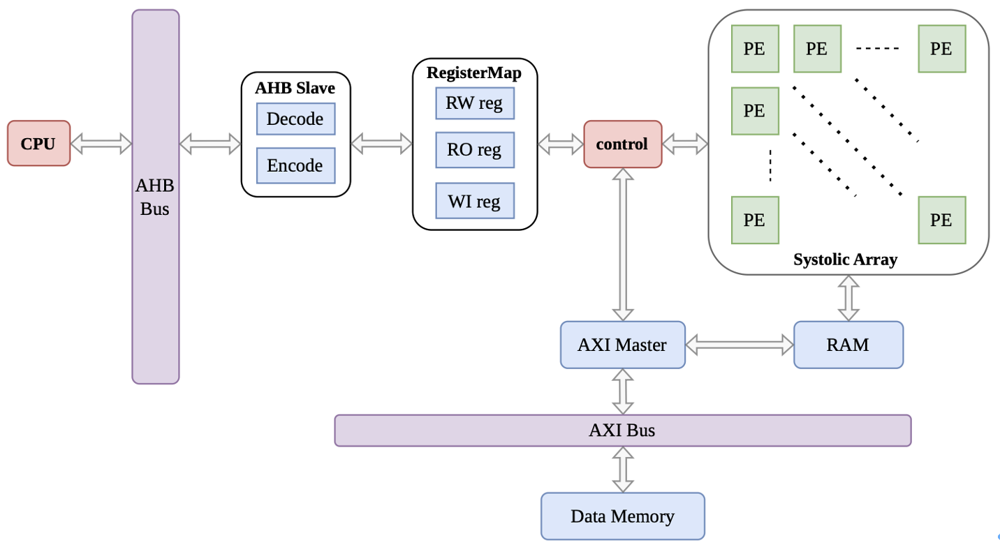
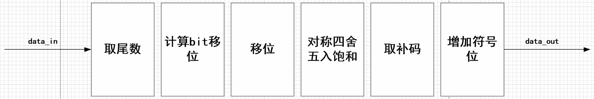
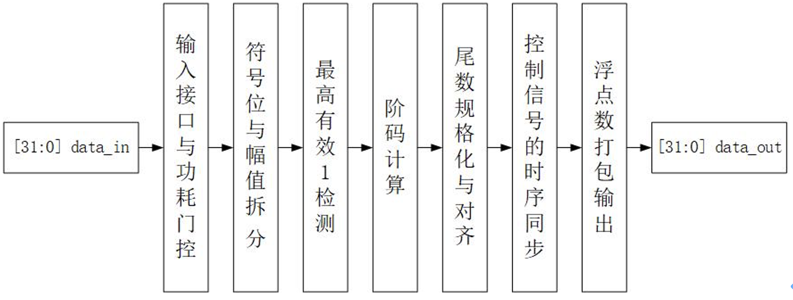
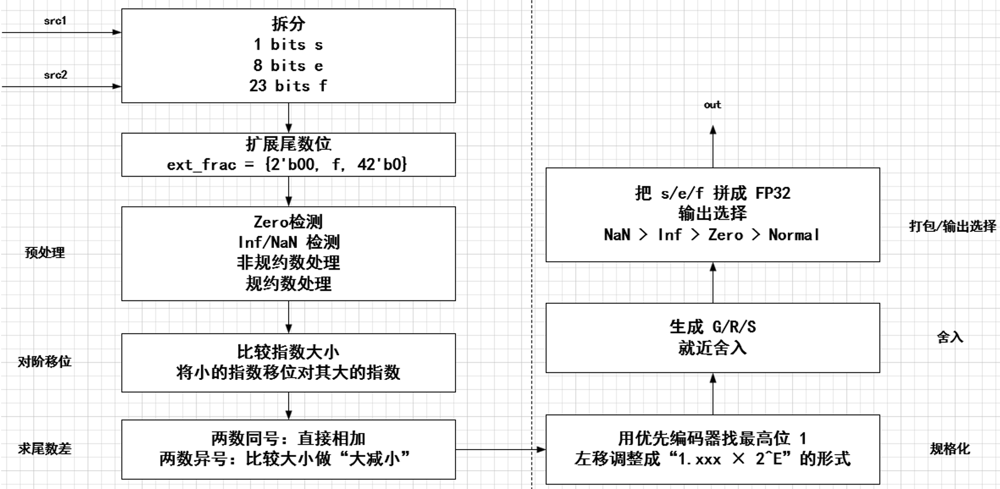

# TPU



这个项目的顶层模块是 `TPU_TOP`，整体可以分成五个主要部分：AHB 从接口、寄存器配置模块、控制模块、AXI-Stream 输入输出模块，以及核心的脉动阵列计算模块。

从系统角度看，它有两条主线：一条是控制流，另一条是计算数据流。控制流由 CPU 通过 AHB-Lite 发起，AHB 从接口先把标准总线访问转换成 TPU 内部的寄存器读写请求，然后交给 `RegisterMap` 处理。`RegisterMap` 是 CPU 和 TPU 内部硬件之间的配置/状态中转层，它定义了哪些地址对应控制寄存器、配置寄存器和状态寄存器。

CPU 写 `RegisterMap` 中的控制和配置寄存器来设置 TPU 的使能、启动、复位、计算模式、矩阵尺寸以及 B 矩阵权重。因为当前阵列是 4x4，所以 B 权重会被拆成 16 个 32-bit 配置值，分别对应 16 个 PE 中固定保存的权重。同时，CPU 也可以从 `RegisterMap` 中读取状态寄存器，获取当前计算状态、完成标志、计数信息和错误状态。

配置完成后，CPU 启动 TPU。控制模块会根据当前状态进入计算流程，并通知 AXI 输入侧开始接收 A 矩阵数据。输入数据通过 AXI-Stream slave 口进入，先写入输入 FIFO。这里使用 FIFO 是为了把外部 AXI 数据流和内部计算节奏解耦，避免两边必须严格同拍工作。

在计算阶段，控制模块会从输入 FIFO 中读取数据。每次读出的是一组打包后的 A 数据，然后送入数据转换模块。数据转换模块会把输入拆成多路行输入，并根据脉动阵列的数据流要求给不同行加入延迟，使 A 数据能够在正确的时间进入对应的 PE 行。

核心计算发生在 `SA_TOP` 中。`SA_TOP` 内部是一个 4x4 的权重固定型脉动阵列。每个 PE 保存一个 B 权重，A 数据在阵列中从左往右传播，部分和从上往下传播。每个 PE 做一次乘加运算，也就是用当前 A 数据乘以本地 B 权重，再加上从上方传来的部分和。最上面一行的部分和从 0 开始，经过多行 PE 逐级累加后，最底部一行输出的就是最终计算结果。

计算结果会被拼成一组输出数据写入输出 FIFO。等计算结果准备好之后，控制模块会通知 AXI 输出侧开始发送数据。AXI-Stream master 口从输出 FIFO 中读取结果，并通过 `tvalid`、`tdata`、`tlast` 等信号把结果传给外部模块。

最后，控制模块还会维护当前状态、计数信息、完成标志和错误状态。这些状态会返回到 `RegisterMap`，CPU 再通过 AHB 读取对应的状态寄存器，判断本轮计算是否完成，以及是否出现异常。


├── 1_rtl
│   ├── AHB
│   ├── AXI_TOP
│   ├── Comm_IP
│   ├── CTRL
│   ├── SA_TOP
│   └── TOP
├── 2_tb
│   ├── cfg
│   ├── env
│   ├── if
│   ├── reg_model
│   ├── seq
│   ├── test
│   ├── top
│   └── tpu_top_tb.f
├── 3_bin
│   ├── env_setup.sh
│   └── Makefile
├── 4_syn
│   ├── out
│   ├── tpu_top.sdc
│   └── tpu_top_syn.f
└── 5_spyglass
    ├── cdc.prj
    ├── lint.prj
    └── tpu_top.sgdc
   

## systolic array `sa.v`
1. 概述: 实例化 `ROW*COL` 个 PE modules `pe.v` 形成一个权重固定型脉动阵列 weight-stationary systolic array, 用于执行矩阵乘法 `C = A * B`
   - `ROW`: PE 行数，在 weight-stationary 数据流中对应矩阵乘法的 K 维度
   - `COL`: PE 列数，对应输出矩阵 C 的列维度 N
   - `PE(r,c)`: 第 r 行第 c 列 PE，固定保存权重 `B[r][c]`
   - `data_in_a`: 每一拍输入一组 A 数据，每个 PE row 一个 A 元素
   - `data_in_b`: 打包所有 PE 的固定 B 权重
   - `data_out`: 最底行 PE 输出的最终部分和，每列一个输出值
2. I/O interface:
   - `input wire clk;`
     `input wire rst_n;`
     `input wire cpu_sw_rst_sync;`
     `input wire cpu_tpu_start_sync;`
     `input wire tpu_en;`
     `input wire [1:0] cpt_mode;`
     `input wire data_in_vld;`
     `input wire [ROW*DW-1:0] data_in_a;`
     `input wire [ROW*COL*DW-1:0] data_in_b;`
   - `output wire data_out_vld;`
     `output wire [COL*DW_OUT-1:0] data_out;`
3. 内部逻辑描述:

   1. weight-stationary 数据映射:
      - 每个 PE 固定接收一个权重 `pe_weight_in`
      - 第 r 行第 c 列 PE 的一维编号为 `PE_IDX = r * COL + c`
      - `PE(r,c)` 使用的固定权重来自:
        ```verilog
        data_in_b[(PE_IDX+1)*DW-1 -: DW]
        ```
      - 对于矩阵乘法 `C = A * B`，可以理解为:
        ```text
        PE(r,c) 保存 B[r][c]
        r 对应 K 维度
        c 对应输出列 c
        ```

   2. A 数据横向流动:
      - 第 0 列 PE 从 SA 左边界接收 A:
        ```verilog
        pe_input_in = data_in_a[(r+1)*DW-1 -: DW]
        ```
      - 其它列 PE 从左边相邻 PE 接收 A:
        ```verilog
        pe_input_in = pe_a_bus[((r*COL + c-1)+1)*DW-1 -: DW]
        ```
      - PE 内部把 `data_in_a` 打一拍输出为 `out_a`，继续传给右边 PE
      - 因此 A 的流动方向是:
        ```text
        PE(r,0) -> PE(r,1) -> PE(r,2) -> ... -> PE(r,COL-1)
        ```

   3. 部分和纵向流动:
      - 第 0 行 PE 从 0 开始累加:
        ```verilog
        pe_psum_in = {DW_OUT{1'b0}}
        ```
      - 其它行 PE 从正上方相邻 PE 接收部分和:
        ```verilog
        pe_psum_in = pe_psum_bus[(((r-1)*COL + c)+1)*DW_OUT-1 -: DW_OUT]
        ```
      - 每个 PE 做:
        ```text
        pe_psum_out = pe_psum_in + pe_input_in * pe_weight_in
        ```
      - 因此部分和的流动方向是:
        ```text
        PE(0,c) -> PE(1,c) -> PE(2,c) -> ... -> PE(ROW-1,c)
        ```
   4. 输出选择:
      - 每一列的输出来自最底行 PE:
        ```verilog
        data_out[(c+1)*DW_OUT-1 -: DW_OUT] =
            pe_psum_bus[(((ROW-1)*COL + c)+1)*DW_OUT-1 -: DW_OUT];
        ```
      - 当所有最底行 PE 的输出都有效时，`data_out_vld` 拉高:
        ```verilog
        data_out_vld = tpu_en & (&bottom_vld)
        ```
   5. 控制计数:
      - `BASE_CYCLES = ROW + COL - 1`
      - `pe_lat_by_mode` 表示 PE 内部延迟:
        - int4/int8: 1 cycle
        - fp32/fp16: 4 cycles
      - `matmul_cycles = BASE_CYCLES + pe_lat_by_mode`
      - `counter` 用于统计一轮数据流穿过阵列需要的周期数
      - `flag_clear` 在软件复位、启动新计算、或一轮计算结束时拉高，用于清除 PE 内部状态

### multi-precision processing unit `pe.v`
1. 概述: 每个PE模块对输入 `data_in_a`, `data_in_b` 支持四种精度运算(fp32, fp16, int8, int4), 根据 `cpt_mode` 选择不同计算通路，最终输出 32-bit partial sum
   - 针对 fp32: 
     - fp32 浮点数乘法 `pe_fp32_multiply.v`
     - delay 对齐输入 partial sum `data_in_add`
     - fp32 浮点数加法/累加 `pe_fp32_adder.v`
     - 输出 FP32
   - 针对 fp16: 
     - 取输入数据 `data_in_a`, `data_in_b` 低 16 位, 浮定转换 `pe_fp16_int16.v`
     - int16 定点乘法得到 int32 product, 定浮转换 `pe_int32_fp32.v` 将 product 转成 FP32
     - delay 对齐输入 partial sum `data_in_add`
     - fp32 浮点数加法/累加 `pe_fp32_adder.v`
     - 输出 FP32
   - 针对 int8: 
     - 取输入数据 `data_in_a`, `data_in_b` 低 8 位
     - signed int8 定点乘法
     - 与 signed int32 partial sum `data_in_add` 累加
     - 输出 int32
   - 针对 int4: 
     - 取输入数据 `data_in_a`, `data_in_b` 低 4 位
     - signed int4 定点乘法
     - 与 signed int32 partial sum `data_in_add` 累加
     - 输出 int32
2. I/O interface:
   - `input wire clk;`
     `input wire rst_n;`
     `input wire tpu_en;`
     `input wire [31:0] data_in_b;`
     `input wire [31:0] cpt_mode;`
     `input wire flag;`
     `input wire data_in_vld;`
     `input wire [31:0] data_in_a;`
     `input wire [31:0] data_in_add;`
   - `output reg data_out_vld;`
     `output reg [31:0] data_out;`: 当前 PE 输出 partial sum
     `output reg [31:0] out_a;`: 将 `data_in_a` 传给右边的 PE module in the systolic array
     `output reg out_a_vld;`
3. 输出 latency:
   - int4/int8: 1 cycle
   - fp32: 4 cycles
   - fp16: 4 cycles


#### fp32乘法 `pe_fp32_multiply.v`
1. 概述: 使用 IEEE 32-bit floating-point binary format 定义的32位浮点数 (`[31]` sign; `[30:23]` 8-bit exponent; `[22:0]` 23-bit fraction; bias = 127) 实现32位浮点数乘法
2. I/O interface: 
   - `input wire clk;` Clock
     `input wire rst_n;` Asynchronous active-low reset
     `input wire vld_in;` Input valid
     `input wire cpt_en;` Compute enable
     `input wire [31:0] a;` = $(-1)^ {s_a} \times 1.{f_a} |_2 \times 2^{(e_a-127)}$
     `input wire [31:0] b;` = $(-1)^ {s_b} \times 1.{f_b} |_2 \times 2^{(e_b-127)}$
   - `output reg vld_out;` Output valid
     `output reg [31:0] out;` = a * b = $(1.{f_a} \times 1.{f_b}) \times 2^{(e_a-127+e_b-127)}$ 
     `output reg out_is_zero;` Indicates if the output is 0
     `output reg out_is_inf;` Indicates if the output is infinite
     `output reg out_is_nan;` Indicates if the output is not a number
     `output reg out_is_of;` Indicates if the output has overflow
     `output reg out_is_uf;` Indicates if the output has underflow
3. 内部逻辑描述:  
   
   <center></center>

   1. 输入处理: 
      - 把 A、B 拆成符号 s、指数 e、尾数 f $\in [1,2)$
      - 处理特殊情况: 
        - e = 0 && f = 0: 0
        - e = 255 && f = 0: inf
        - e = 255 && f != 0: NaN
        - e = 0 && f != 0: denormal/ subnormal
          - 这里一起归入 zero 的处理
      - 符号处理 s_out = s_a XOR s_b
   2. 尾数相乘 `[47:0] f_multi` = 1.f_a * 1.f_b $\in [1,4)$ (`[47:46]` 是整数部分, `[45:0]` 是小数部分), 再移位置 `[47:0] f_output` (`[47:46]` 是整数部分, `[45:0]` 是小数部分) 
   3. 阶码相加 `[8:0] e_add` = e_a - 127 + e_b, 根据尾数是否移位再调整 `[8:0] e_add_shift`
   4. 规格化移位对尾数和阶码的调整：如果尾数乘积结果大于等于2，则需要右移一位，并且阶码加1.
      - if (`f_multi` >=2): `[47:0] f_multi_shift = f_multi >> 1`, `[9:0] e_add_shift = e_add + 1`.
   5. 尾数舍入处理: 因为尾数相乘会产生比 23 位更多的位数，最后只能存 23 位尾数，所以要按规则截断。这里使用: RNE算法
      - `[24:0] f_round`中，`[24:23]` 代表小数点前的部分，`[22:0]` 代表小数点后的部分
   6. 处理一种特殊情况：如果 `f_multi_shift` 的整数部分是 1.1111...1，在舍入处理后 `f_round` 是 10.0000...0，这时需要将尾数再次移位（调整为 01.0000...0），并且阶码再次加1
      - 这步产生尾数 `[22:0] f_out` 
      - 这步产生阶码 `[9:0] e_out`
   7. overflow/underflow 监测
      - 阶码再调整后，if `e_out` >= 255, 产生overflow
      - 阶码再调整后，if `e_out` <= 0, 产生underflow
   8. 通路选择
      ```verilog
      if (is_NaN) {1'b0, 8'hff, 23'h1}
      else if (is_inf) {s_out, 8'hff, 23'h0}
      else if (is_zero) {s_out, 8'h0, 23'h0}
      else if (underflow) {s_out, 8'h0, 23'h0}
      else if (overflow) {s_out, 8'hff, 23'h0}
      else 原乘法计算结果 {s_out, e_out[7:0], f_out}
      ```
4. 补充: 截断规则: 对于某个数 `[45:0] x`, 截断后的数为 `[22:0] y`
   - RZ算法: 直接截断
   - 正无穷舍入:
     - 对正数: 只要 `x[22:0]` 有1, `y = f_output [45:23] + 1`;
     - 对负数: 直接截断
   - 正向四舍五入:
     - 正数
        - 如果被丢掉的部分明显>=一半, i.e., `x[22] == 1`: 进 1
        - 如果明显<一半, i.e., `x[22] == 0`: 不变
      - 负数: 直接截断
   - RNE算法:
     - 如果被丢掉的部分>一半, i.e., `x[22] == 1 && x[21:0] != 0`: 进 1
     - 如果<一半: 不变
     - 如果=一半, i.e., `x[22] == 1 && x[21:0] == 0`: 如果最后保留位是奇数, 进 1; 是偶数, 不变Special

#### 浮定转换 `pe_fp16_int16.v` 
1. 概述: 使用 IEEE 16-bit floating-point binary format 定义的16位浮点数 (`[15]` sign; `[14:10]` 5-bit exponent; `[9:0]` 10-bit fraction; bias = 15) 实现 16 位浮点数到 16 位 int 定点数的转换
2. I/O interface: 
   - `input wire clk;` 
     `input wire rst_n;` 
     `input wire vld_in;`
     `input wire cpt_en;` 
     `input wire [15:0] in;` IEEE FP16 input, $(-1)^s \times 1.f \times 2^{(e-15)}$
   - `output reg vld_out;` Output valid
     `output reg [15:0] out;` Signed two's-complement int16 output
     `output reg out_is_of;` Indicates if the conversion has overflow
     `output reg out_is_uf;` Indicates if the conversion has underflow
3. 内部逻辑描述:  

   <center></center>

   1. 输入处理: 
      - 把输入 `[15:0] in` 拆成符号 `s_in = in[15]`、5-bit 指数 `e_in = in[14:10]`、10-bit 尾数 `f_in = in[9:0]`
      - 处理输入的特殊情况：当前实现把 subnormal/inf/NaN 作为特殊输入处理，不进入普通尾数移位路径
        - `in_is_zero`: `e_in == 0 && f_in == 0`
        - `in_is_subnormal`: `e_in == 0 && f_in != 0`
        - `in_is_inf`: `e_in == 31 && f_in == 0`
        - `in_is_nan`: `e_in == 31 && f_in != 0`
   2. 计算真实指数: `real_e_in = e_in - 15`
   3. 尾数移位:
      - 如果 `real_e_in >= 0`，尾数左移, i.e., `[24:0] f_shift = {1'b1, f_in} << abs(real_e_in)`
      - 如果 `real_e_in < 0`，尾数右移, i.e., `[24:0] f_shift = {1'b1, f_in} >> abs(real_e_in)`
      - 对于 zero/subnormal/inf/NaN，`data_mask` 会屏蔽普通移位路径
   4. 位宽变换和舍入:
      - 从移位后的结果中取整数部分 15-bit `f_shift[24:10]`
      - 使用 `f_shift[9]` 作为 round bit 做简单 round-up
      - 得到 magnitude 后，根据 `s_in` 转成 signed two's-complement int16
   5. overflow/underflow 监测:
      - 产生 overflow
        - `in_is_inf` / `in_is_nan` / `real_e_in >= 15` 
        - 正数舍入后超过 `+32767` 时产生 overflow
        - 负数允许刚好输出 `-32768`，超过 `-32768` 时产生 overflow
      - 当前实现只把 subnormal 作为 underflow。小于 1 的普通数按舍入规则转成 0 或 1，不额外报 underflow 
   6. 通路选择:
      ```verilog
      if (in_is_zero)     out = 16'h0000;
      else if (out_is_uf) out = 16'h0000;
      else if (out_is_of) out = s_in ? 16'h8000 : 16'h7fff;
      else                out = s_in ? -mag_round : mag_round;
      ```
   7. 输出时序:
      - `vld_in` 先打一拍得到 `vld_in_1d`
      - `out/out_is_of/out_is_uf/vld_out` 在 `vld_in_1d` 有效时输出

#### 定浮转换 `pe_int32_fp32.v`
1. 概述: 将 32 位 signed two's-complement int 转换成 IEEE 32-bit floating-point binary format (`[31]` sign; `[30:23]` 8-bit exponent; `[22:0]` 23-bit fraction; bias = 127)
2. I/O interface:
   - `input wire clk;`
     `input wire rst_n;`
     `input wire vld_in;`
     `input wire cpt_en;`
     `input wire [31:0] in;` Signed two's-complement int32 input
   - `output reg vld_out;` Output valid
     `output reg [31:0] out;` IEEE FP32 output
     `output reg out_is_zero;` Indicates if the input/output is zero
3. 内部逻辑描述:

   <center></center>

   1. 输入处理: 
      - 把输入 `[31:0] in` 拆成符号 `s_in = in[31]` 和 31-bit 数值部分
        - 如果 `s_in == 1`，对输入取 two's-complement 绝对值, i.e., `[31:0] mag_in = ~in + 1'b1`
        - 如果 `s_in == 0`，直接使用输入作为绝对值, i.e., `[31:0] mag_in = in`
      - `in_is_zero = (in == 32'b0)`
   2. 最高有效1检测/ LOD/ Leading one detect: 找到 `mag_in` 最高位的 1 (整数最高有效位)，记为 `[4:0] lod_index` (范围 `[0,31]`).
   3. 生成阶码 `[7:0] exp_base = 8'd127 + lod_index;`
   4. 尾数移位:
      - 如果 `lod_index <= 23`，说明 int32 的有效位可以完整放入 FP32 的 23-bit fraction，需要左移对齐, i.e.,
        - `[23:0] mag_in_shift = mag_in << (23 - lod_index);`
        - `[22:0] frac = mag_in_shift[22:0];`
      - 如果 `lod_index > 23`，说明低位需要被截断，需要右移对齐, i.e.,
        - `[2:0] mag_in_shift = mag_in >> (lod_index - 23);`
   5. 舍入处理: 当 `lod_index > 23` 时，使用 Round-bit (被截断部分的最高位) 和 Sticky-bit (更低被截断位的 OR) 做 RNE 风格舍入.
      - 当 `round_bit == 1` 且 `(sticky_bit == 1 || mag_in_shift[0] == 1)` 时进位, i.e., `[24:0] mag_in_round = {1'b0, mag_in_shift} + 1'b1;`
      - 如果舍入后尾数进位，指数 `exp_base` 加 1 变成 `exp`，尾数右移一位
   6. 通路选择输出:
      ```verilog
      if (in_is_zero) out = 32'h00000000;
      else            out = {s_in, exp, frac};
      ```
   7. 输出时序:
      - `out/out_is_zero/vld_out` 在 `vld_in` 有效后的下一个时钟输出

#### fp32加法 `pe_fp32_adder.v`
1. 概述: 使用 IEEE 32-bit floating-point binary format 定义的32位浮点数 (`[31]` sign; `[30:23]` 8-bit exponent; `[22:0]` 23-bit fraction; bias = 127) 实现32位浮点数加法
2. I/O interface:
   - `input wire clk;`
     `input wire rst_n;`
     `input wire [31:0] a;` = $(-1)^{s_a} \times 1.{f_a}|_2 \times 2^{(e_a-127)}$
     `input wire [31:0] b;` = $(-1)^{s_b} \times 1.{f_b}|_2 \times 2^{(e_b-127)}$
   - `output reg [31:0] out;` = a + b
3. 内部逻辑描述:

   <center></center>

   1. 输入处理:
      - 把 `a`、`b` 拆成符号 s、指数 e、尾数 f
      - 尾数扩展成 `[66:0] extended_f`
        - `[66]` 用于保存加法进位
        - `[65]` 用于保存 hidden bit
        - `[64:42]` 对应 FP32 23-bit fraction
        - `[41:0]` 用于保留对阶和舍入过程中的额外精度
      - 特殊情况处理:
        - e = 0: hidden bit 置 0，按 zero/subnormal 路径处理
        - e != 0: hidden bit 置 1，按 normal FP32 路径处理
        - e = 255 && f = 0: inf
        - e = 255 && f != 0: NaN
   2. 对阶处理:
      - 比较两个输入的指数 `e_a` 和 `e_b`, 指数较小的一方尾数右移 `abs(e_a - e_b)` 位
      - 输出指数 `[8:0] e_out` 取两个输入指数中的较大值，用于保留 overflow/underflow 判断空间
   3. 尾数加减:
      - 如果 `s_a == s_b`，两个尾数相加得到 `[66:0] f_out`，输出符号 `s_out = s_a`
      - 如果 `s_a != s_b`，较大尾数减较小尾数得到 `[66:0] f_out`，输出符号取幅值较大的操作数符号
   4. 规格化:
      - 如果尾数加法产生进位 `f_out[66] == 1`，尾数右移一位，指数加 1
      - 如果 `f_out[65] == 0` 且结果非 0，使用 priority encoder 找到最高有效 1
        - 根据最高有效 1 的位置左移尾数，同时调整 `e_out`
      - 如果尾数结果为 0，输出 zero
   5. 舍入处理: 根据 `G_bit  = f_out_normalized[41];` `S_bit = |f_out_normalized[40:0];` 进行 RNE 舍入处理。
      - 舍入后再处理：检查是否进位 
   6. 通路选择:
      ```verilog
      if (a_is_nan || b_is_nan || (a_is_inf && b_is_inf && (s_a ^ s_b))) out_comb = NaN;
      else if (a_is_inf || b_is_inf || exponent overflow)                 out_comb = inf;
      else if (f_out_round == 0 || exponent underflow)                    out_comb = 32'h00000000;
      else                                                                out_comb = {s_out, e_out_round[7:0], f_out_round[64:42]};
      ```
   7. 输出时序:
      - `out_comb` 是组合逻辑计算结果
      - `out` 在 `posedge clk` 打一拍输出，`rst_n` 拉低时清 0
